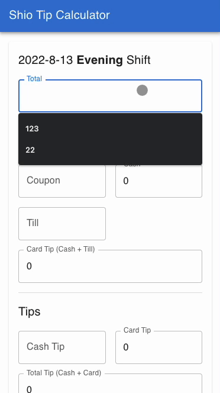

## Shio Tip Calculator

Shio restaurant has a very unique way of splitting tips for their staff. Calculation is done by hand at the end of the shift and can take some time, which led me to create this tip calculator app for my girl friend and her coworkers :).

The app is deployed on GitHub Pages and can be found [here](https://kyubinhan.github.io/shio-tip-calculator/).

Note: this project was bootstrapped with [Create React App](https://github.com/facebook/create-react-app).
[Material-UI](https://mui.com/) and [react-final-form](https://final-form.org/react) were used to handle form inputs.

---

Unique calculation in action

Explanation: Normally 3 wait staff would split \$600 into 3 ways evenly. However a staff is on training and gets only 50% of his/her original tips (hence \$100). The rest goes to staff with 100% ratio (trainer), which in this case the two trainers will split the rest of the tips evenly (\$200 + \$50).
